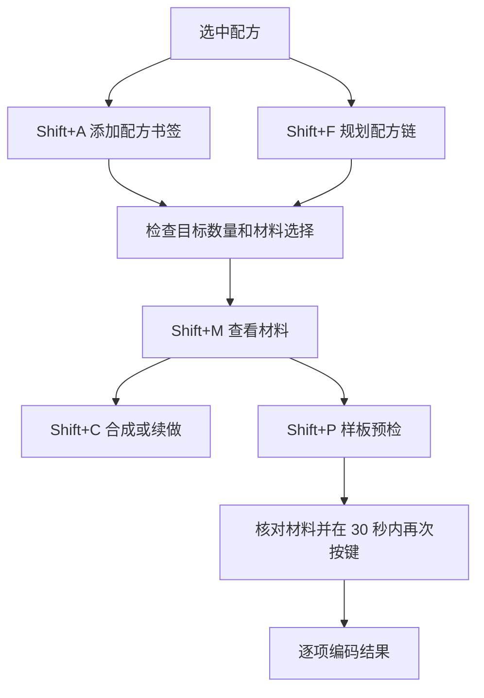

# 使用指南

适用版本：brewing1（包含 suite10 功能），Minecraft 1.12.2。快捷键可以在游戏设置中调整，下表是默认值。所有步骤都以已适配的界面为前提，见[兼容表](COMPATIBILITY.md)。

## 安装与第一条配方链

1. 从 [Release](https://github.com/lingning0806/HEI-Recipe-Chain/releases/tag/v4.29.13-nova.11-brewing1) 下载 `HadEnoughItems_1.12.2-4.29.13-nova.11-brewing1.jar`。
2. 完全退出游戏，备份原 HEI、配置和存档。移出原 HEI/JEI，再放入本 JAR；它们使用相同的 modid，不能同时加载。
3. 打开配方界面，指向要记录的配方，按 Shift+A 添加配方书签。需要展开配方链时，对当前选中的配方使用 Shift+F。
4. 检查生成的配方组、数量和具体材料。多个路线无法确定时，先指定路线；待补材料不等于已经自动安排了生产配方。
5. 鼠标放到左侧配方组括号，按 Shift+M 检查材料，再执行合成或编码。



这是操作流程示意，不是游戏界面截图。显示顺序与实际执行顺序不同：显示优先展示成品，执行要先满足依赖和返还物条件。

## 常用操作

| 操作 | 鼠标位置/界面 | 作用 |
|---|---|---|
| Shift+A | 配方界面当前配方 | 添加配方书签 |
| Shift+F | 当前选中配方 | 自动规划配方组，保留已指定路线 |
| Shift+C | 配方组括号，已适配合成界面 | 合成；中断后按剩余目标续做 |
| Shift+T | 配方组括号，已适配 AE 界面 | 从 AE 取出所需的可用物品 |
| Shift+M | 配方组括号 | 查看本次计划材料明细 |
| Shift+P | 配方组括号，已适配样板终端 | 第一次预检，再次确认编码 |
| Shift+G | 具体配方书签，工作台或 AE 合成终端 | 第一次投影，再次按键填充直接材料 |
| 点击括号 / Shift+V | 配方组括号 | 切换显示视图 |
| 拖动括号经过其他组 | 左侧书签栏 | 合并分组；单击不合并 |
| 右键括号 | 左侧书签栏 | 拆组 |
| Ctrl+Z | 书签编辑界面 | 撤销支持的书签编辑 |
| ← / →，X | 材料明细面板 | 翻页、关闭面板；不代表所有 HEI 页面的翻页键 |

将左侧配方中的物品拖到已适配 AE 搜索框可搜索库存。拖组到过滤槽属于另一项适配，不等于向网络存入物品。

## 缺料后继续

1. 记录停止提示中的配方与缺料，查看 Shift+M 的本次剩余需求。
2. 向同一 AE 网络或可用背包库存补充材料，等待终端库存刷新。
3. 对原配方组再次按 Shift+C。不要为了续做重新生成、替换或增加书签目标。
4. 核对最终成品数量。本次执行进度与原书签目标分开；原目标保留供以后使用。

桶的内容会被消耗，空桶可以返还；返还空桶不等于恢复牛奶或水。只有一组容器时，调度可能需要重复“装填 → 使用 → 返还”。

## 批量写样板

1. 打开已适配 AE 样板终端，并切换到合成模式。准备空白样板和背包空间。
2. 指向配方组括号按 Shift+P。当前每组最多预检 64 个配方，超过时拆组。
3. 阅读逐项预检结果和具体材料，确认所需空白样板数量。
4. 保持同一组、同一终端，在 30 秒内再次按 Shift+P。超时或计划变化时重新预检。
5. 检查成功、跳过、失败的逐项结果。样板按单次配方编码，书签目标为 16 份不表示生成 16 张同配方样板。

去重涵盖当前批次/背包中可识别的同样板，不宣称扫描整个 AE 网络或所有机器内已有样板。编码不消耗配方中的金属、木板等原料，但消耗空白样板。

## 投影、填充与撤销

Shift+G 面向具体九宫格配方，不会自动制作下级材料。需要整链执行时使用 Shift+C。若旧材料与新投影冲突，先移走红框旧材料；填充不会替你取出成品。

Ctrl+Z 撤销的是书签编辑。例如把目标从 1 改为 4，撤销后恢复为 1；撤销涉及材料选择的编辑时，应恢复编辑前的具体材料。它不会回滚已经发生的合成、库存转移或样板编码。

无法复现上述操作时，请通过[反馈模板](https://github.com/lingning0806/HEI-Recipe-Chain/issues/new/choose)提供环境、按键时鼠标位置、操作步骤及日志。

## 材料偏好示例

使用偏好功能后，HEI 配置文件所在目录会生成 `recipe-preferences.txt`。例如优先用橡木木板制作工作台：

```text
output = minecraft:crafting_table
input = item:minecraft:planks@0; mod:minecraft
```

分号分隔优先级，越靠前优先。文件自带示例外的 `$$` 行用于注释示例块，启用时按文件提示去掉；不要把未结束的注释块留在规则前。

规则支持物品、模组、矿物词典及配方路线选择；具体语法见生成文件的注释。使用时约一秒内重新加载，解析错误保留上一份有效规则。已有书签保存的具体选择优先保留，修改规则后应在新建的计划中检查效果；样板采用该计划选定的材料。1.12.2 的矿物词典名称不能直接当作现代版本标签名称。

## 酿造配方升级

brewing1 将三瓶输入与三瓶输出作为整批处理；目标 1 或 3 瓶需要 3 瓶基础药水，目标 4 瓶需要 6 瓶，目标 16 瓶需要 18 瓶。逐级酿造不再重复乘 3。旧组的目标数量不会被自动重写，请检查成品目标并重新生成药水组。
